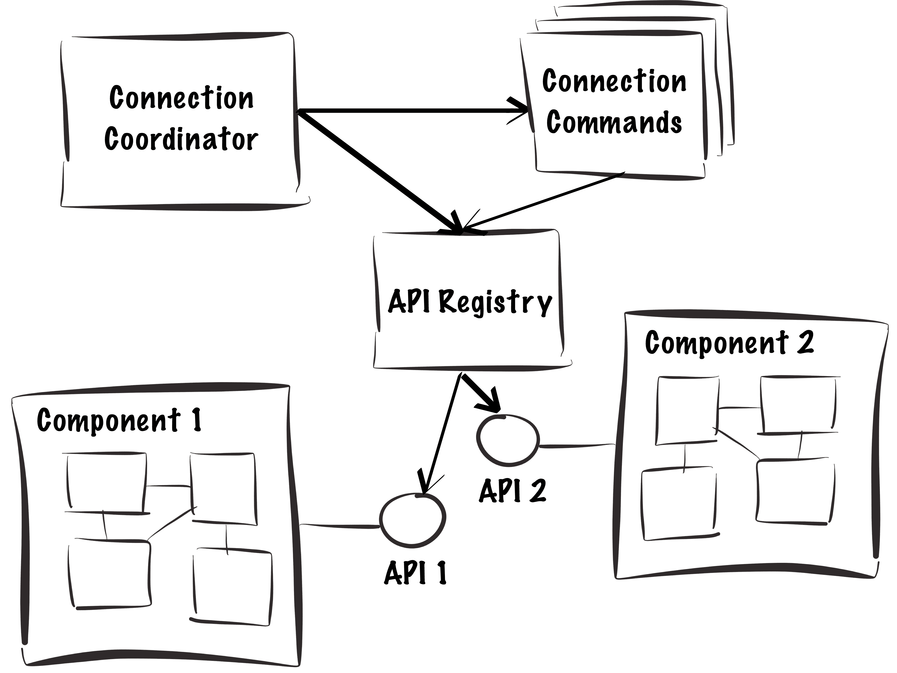

#Event API
**Aims to help reduce the rate at which complexity increases during the development of non-trivial JavaScript applications.**

Would you like your JavaScript application to be composed of very loosely-coupled components, each with a cleanly defined API?

Do you need to support software components that come into and out of existence during the lifetime of your application?

Would you like to improve the maintainability of your event architecture?

If so, then **EventAPI** may be for you.

##Installation

If you use Bower, run:

    bower install event-api

...and then include the script file in your html:

    <script src="bower_components/event-api/dist/event-api.min.js"></script>
    
Without Bower, clone/download this repository and include `dist/event-api.min.js` in your html:

    <script src="event-api.min.js"></script>

##Main Concepts

 - **EventApi** - a constructor function to be used as the prototype for APIs that support publish/subscribe semantics.
 - **ApiRegistry** - an object literal used as a store for references to the `EventApi`s loaded at any given moment.
 - **EventApiConnectionCoordinator** - a constructor function containing functionality for loading and unloading `EventApi`s.
 - **ConnectCommands** - constructor functions you write following the command pattern to encapsulate the relationship between `EventApi`s. 
 
###In Prose 

First, for each software component in your application that you want to communicate via **EventApi**, create an API object with `EventApi` on its prototype. These APIs act as the entry and exit points for events into and out of your components. 

Then, for each of those `EventApi`s, create a single `ConnectCommand` to encapsulate the knowledge of who that API should listen to and how it should respond. Note: no business-logic is present in the connect commands; just pointers to functions. 

Now with your `EventApi`s and `ConnectCommands` in place, create a single `EventApiConnectionCoordinator` and a corresponding single `EventApiRegistry` for your application. This will enable graceful runtime loading and unloading of components. 

The `EventRegistry` is an implementation-detail and acts as a central store for the loaded APIs. 

And... you're done. 

Your software components will now all be talking to one another without really knowing who they're talking to (and hence keeping coupling to a minimum), BUT the behavior will be easier to reason about and maintain because the knowledge about how everything is connected resides inside a well-defined location - the connection commands - which follow a readable configuration pattern like so:

```javascript
myApi.on(myApi.events.error)
     .notify(myOtherApi)
     .byCalling('onEventFromMyApi');
```

###In a Picture



##Example 1

Say you have two APIs acting as public interfaces for two software components. `api2` raises `error` events and you want `api1` notified of these events.

Neither API need know about each other. **EventApi** enables `api1` to respond to events raised by `api2` via a mediating object. Like so:

```javascript
// First, create two APIs with an EventApi on their prototype...
function Api1() {}
Api1.prototype = new eventApi.EventApi();
Api1.prototype.constructor = Api1;
Api1.prototype.onErrorFromApi2 = function () {
    console.log('Api1::onErrorFromApi2 invoked!');
};

function Api2() {}
Api2.prototype = new eventApi.EventApi();
Api2.prototype.constructor = Api2;
Api2.prototype.events = { error: 1 };

// Now create a connect-command to encapsulate the wire-up between the two APIs...
function Api1ConnectCommand() {
    this.subjectApiName = 'Api1'; //The API this connect command is for.
    this.objectApiNames = [ 'Api2' ]; //The API(s) this connect command links the subject API together with.

    this.run = function (apiRegistry) {
      var api1 = apiRegistry[this.subjectApiName];
      var api2 = apiRegistry[this.objectApiNames[0]];
      
      if(api2) {
        api2.on(api2.events.error)
            .notify(api1)
            .byCalling('onErrorFromApi2'); //When api2 raises an error then api1.onError is called.
      }
    };
}

// Let's new everything up...
var apiRegistry = {},
    api1 = new Api1(), 
    api2 = new Api2(),
    api1ConnectCmd = new Api1ConnectCommand(api1, api2);

// ...and finally, create a connection coordinator to help us manage the loaded APIs 
var coord = new eventApi.EventApiConnectionCoordinator([ api1ConnectCmd ], apiRegistry, { initialApisToLoad: [ api1, api2 ] });

// Api2 now has a single subscriber to its error event...
console.log(coord.apis['Api2'].subscribers[api2.events.error].length); // Logs 1

// You can now publish an event on Api2, and Api1 will be notified
api2.publish(api2.events.error); // Logs 'Api1::onErrorFromApi2 invoked!'

// You can also unload an API at runtime...
coord.unloadApi('Api1');

// Now when you raise an event from Api2, nothing is logged...
api2.publish(api2.events.error); // Nothing is written to the console

// ..and the subscriptions for the unloaded API have been deleted...
console.log(coord.apis['Api2'].subscribers[api2.events.error].length) // Logs 0

// You can re-load Api1 at runtime to return to how you were before it was unloaded...
coord.loadApi(api1);
api2.publish(api2.events.error);  // Logs 'Api1::onErrorFromApi2 invoked!'

```

##Example 2

What happens when another API, `Api3`, is subscribed to `Api4` via its connect command, but `Api4` is not loaded when `Api3` is loaded?

```javascript
// First, create the API constructor functions...
function Api3() {}
Api3.prototype = new eventApi.EventApi();
Api3.prototype.constructor = Api3;
Api3.prototype.onEventFromApi4 = function () {
    console.log('Api3::onEventFromApi4 invoked!');
};
Api3.prototype.onEventFromApi5 = function () {
    console.log('Api3::onEventFromApi5 invoked!');
};

function Api4() {}
Api4.prototype = new eventApi.EventApi();
Api4.prototype.constructor = Api4;
Api4.prototype.events = { api4Event: 1 };

function Api5() {}
Api4.prototype = new eventApi.EventApi();
Api5.prototype.constructor = Api5;
Api5.prototype.events = { api5Event: 1 };

// Now create a connect-command to encapsulate the wire-up between the three APIs.
// Note that Api3 will be listening to events from both Api4 and Api5...
function Api3ConnectCommand() {
    this.subjectApiName = 'Api3'; 
    this.objectApiNames = [ 'Api4', 'Api5' ]; 

    this.run = function (apiRegistry) {
        var api3 = apiRegistry[this.subjectApiName];
        var api4 = apiRegistry[this.objectApiNames[0]];
        var api5 = apiRegistry[this.objectApiNames[1]];
        
        if(api4) {
            api4.on(api4.events.api4Event)
              .notify(api3)
              .byCalling('onEventFromApi4');
        }

        if(api5) {
            api5.on(api5.events.api5Event)
              .notify(api3)
              .byCalling('onEventFromApi5');
        }
    };
}

// Let's new everything up (excluding Api4)...
var api3 = new Api3(),  
    api5 = new Api5(),  
    api3ConnectCmd = new Api3ConnectCommand();

// ...and create the connection coordinator. 
// Note that Api4 is still nowhere to be seen...
var coord = new eventApi.EventApiConnectionCoordinator([ api3ConnectCmd ], { initialApisToLoad: [ api3, api5 ] });

// Api3 and Api5 are now wired up...
api5.publish(api5.events.api5Event);  // Logs 'Api3::onEventFromApi5 invoked!'

// Now let's load Api4 dynamically...
var api4 = new Api4();

// Simply instantiating Api4 does not wire it up...
api4.publish(api4.events.api4Event);  // Nothing is logged to the console.

coord.loadApi(api4);

// Loading Api4 causes Api3 to complete its subscriptions, and register to be notified of events from the newly loaded Api4.
api4.publish(api4.events.api4Event);  // Logs 'Api3::onEventFromApi4 invoked!'

```

##Tech Notes

This library makes use of the following functions that may need to be poly-filled:

 - `Array.filter`
 - `Array.find`
 - `Array.map`
 - `Array.reduce`
 - `Object.create`
 - `Object.getOwnPropertyNames`
 
##License & Copyright

This software is released under the MIT License. It is Copyright 2014, Ben Aston. I may be contacted at ben@bj.ma.

##How to Contribute

Pull requests including bug fixes, new features and improved test coverage are welcomed. Please do your best, where possible, to follow the style of code found in the existing codebase.
